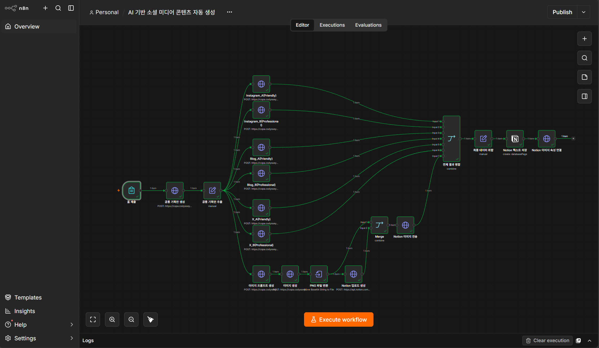
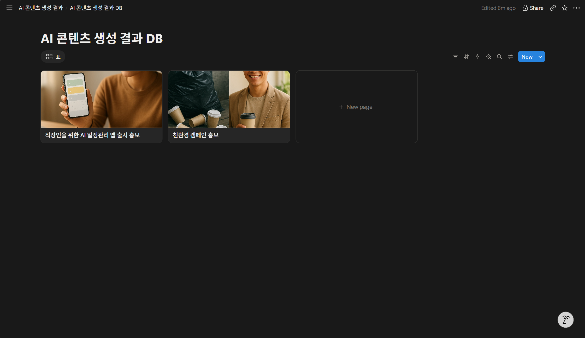
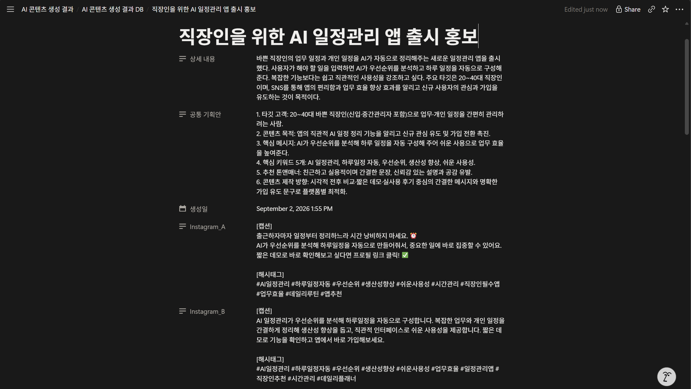
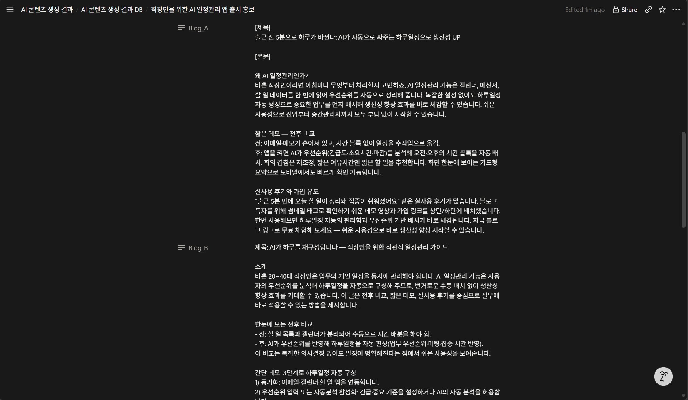
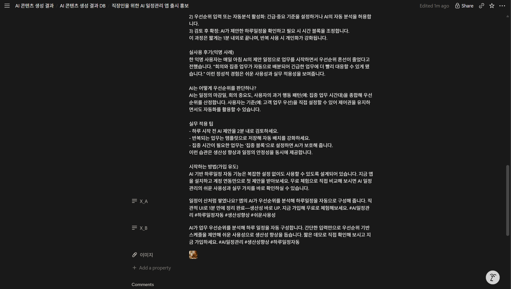
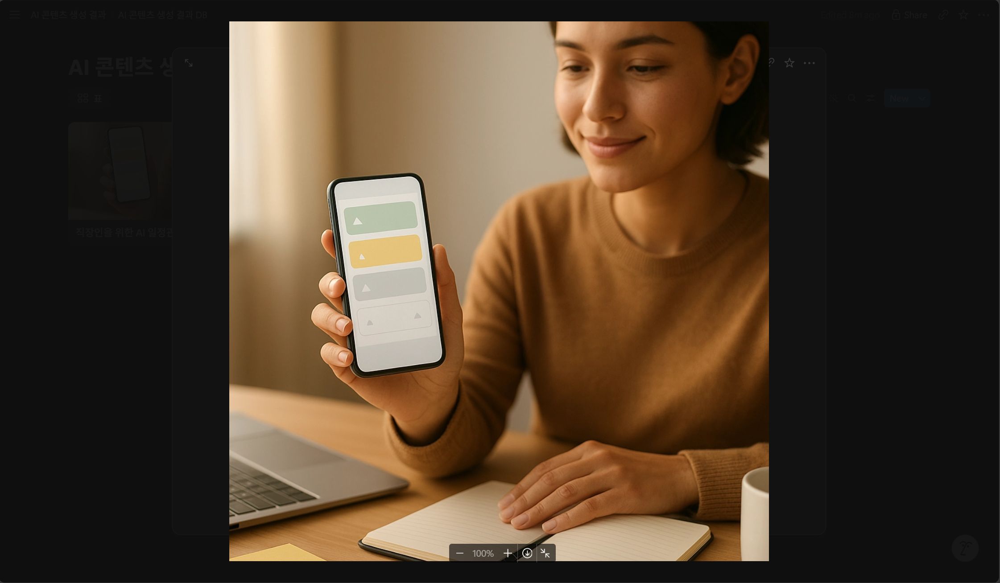

# B2-3 [Project C] AI 기반 소셜 미디어 콘텐츠 자동 생성

## 1. 프로젝트 소개

하나의 **주제와 상세 내용**을 입력하면 생성형 AI를 활용하여 Instagram, Blog, X(구 Twitter) 등 여러 소셜 미디어 플랫폼에 맞는 콘텐츠를 자동으로 생성하고, 콘텐츠에 활용할 **대표 이미지까지 생성하여 Notion 데이터베이스에 자동 저장하는 워크플로우**

소셜 미디어 콘텐츠를 제작할 때 동일한 주제를 플랫폼별 특성에 맞게 반복해서 작성해야 하는 비효율을 줄이고, 하나의 기획안을 기반으로 여러 채널의 콘텐츠를 동시에 제작할 수 있도록 자동화하는 것을 목표로 함

본 프로젝트는 **n8n**을 중심으로 텍스트 생성 AI, 이미지 생성 AI, Notion API를 연결하여 다음 전체 과정을 자동화

```text
사용자 입력
    ↓
공통 콘텐츠 기획
    ↓
플랫폼별 콘텐츠 생성
    ↓
대표 이미지 생성
    ↓
결과 병합
    ↓
Notion 자동 저장
```

또한 보너스 과제인 **A/B 테스트**를 적용하여 각 플랫폼별로 `Friendly`와 `Professional` 두 가지 톤앤매너의 콘텐츠를 동시에 생성하도록 구성

> 본 프로젝트는 팀 프로젝트 과제 내용을 기반으로 개인 학습을 목적으로 별도 구현

---

## 2. 프로젝트 목표

본 프로젝트의 주요 목표는 다음과 같다.

\- 하나의 주제에서 여러 플랫폼용 콘텐츠 자동 생성  
\- 플랫폼 특성에 맞는 콘텐츠 형식 적용  
\- 플랫폼별 적절한 톤앤매너 적용  
\- 생성형 AI를 활용한 공통 콘텐츠 기획안 생성  
\- Instagram / Blog / X 콘텐츠 자동 생성  
\- 플랫폼별 A/B 버전 자동 생성  
\- 콘텐츠 주제에 맞는 대표 이미지 자동 생성  
\- 생성된 텍스트와 이미지를 Notion 데이터베이스에 자동 저장  
\- 다양한 주제에 반복적으로 사용할 수 있는 범용 자동화 워크플로우 구축  

---

## 3. 과제 요구사항 구현 현황

| 요구사항 | 구현 여부 | 구현 내용 |
|:---:|:---:|:---:|
| 주제 또는 키워드 입력 | ✅ | n8n Form을 통한 주제 / 상세 내용 입력 |
| 입력 시 워크플로우 실행 | ✅ | Form 제출을 Trigger로 전체 자동화 실행 |
| Instagram 콘텐츠 생성 | ✅ | 캡션 + 해시태그 생성 |
| Blog 콘텐츠 생성 | ✅ | 제목 + 500자 이상 본문 + 구조화된 내용 생성 |
| X 콘텐츠 생성 | ✅ | 280자 이내 핵심 콘텐츠 생성 |
| 플랫폼별 톤앤매너 적용 | ✅ | 플랫폼 특성에 맞는 프롬프트 적용 |
| 대표 이미지 생성 | ✅ | 공통 기획안을 기반으로 AI 이미지 생성 |
| Notion 자동 저장 | ✅ | 텍스트 및 이미지 자동 저장 |
| 플랫폼별 결과 구분 | ✅ | Instagram / Blog / X 별도 Property 저장 |
| A/B 테스트 | ✅ | Friendly / Professional 두 가지 버전 생성 |
| 범용 프롬프트 | ✅ | 특정 캠페인에 종속되지 않는 프롬프트 설계 |

---

## 4. 사용 기술

| 구분 | 사용 기술 |
|:---:|:---:|
| Workflow Automation | n8n |
| Text Generation | OpenAI API |
| Image Prompt Generation | OpenAI API |
| Image Generation | AI Image Generation API |
| Data Storage | Notion |
| API Integration | HTTP Request / Notion API |
| Image Processing | Base64 → PNG 변환 |

---

## 5. 전체 워크플로우

전체 자동화 과정은 다음과 같이 구성

```text
[폼 제출]
    ↓
[공통 기획안 생성]
    ↓
[공통 기획안 추출]
    ↓
    ├── [Instagram_A : Friendly]
    ├── [Instagram_B : Professional]
    │
    ├── [Blog_A : Friendly]
    ├── [Blog_B : Professional]
    │
    ├── [X_A : Friendly]
    ├── [X_B : Professional]
    │
    └── [이미지 프롬프트 생성]
                ↓
           [이미지 생성]
                ↓
           [PNG 파일 변환]
                ↓
           [Notion 업로드]
                ↓
        [전체 결과 병합]
                ↓
        [최종 데이터 취합]
                ↓
        [Notion 텍스트 저장]
                ↓
        [Notion 이미지 속성 연결]
```

텍스트 콘텐츠 생성과 이미지 생성 작업을 분기하여 처리한 뒤 최종 단계에서 다시 데이터를 병합하고, 하나의 Notion 데이터베이스 페이지에 결과가 통합되도록 구성

---

# 6. 단계별 워크플로우 설명

## 6.1 사용자 입력

n8n Form을 이용하여 사용자가 콘텐츠 제작에 필요한 정보를 입력할 수 있도록 구성

### 입력 항목

- 주제
- 상세 내용

예시:

```text
주제:
직장인을 위한 AI 일정관리 앱 출시 홍보

상세 내용:
바쁜 직장인의 업무 일정과 개인 일정을 AI가 자동으로 정리해주는
새로운 일정관리 앱의 주요 기능과 편리함을 SNS를 통해 홍보한다.
```

Form이 제출되면 입력된 데이터를 기반으로 전체 자동화 워크플로우가 실행


## 6.2 공통 콘텐츠 기획안 생성

입력된 주제와 상세 내용을 바로 플랫폼별 콘텐츠 생성에 사용하는 대신, 먼저 AI가 전체 캠페인의 방향을 설정하는 **공통 콘텐츠 기획안**을 생성하도록 설계

공통 기획안에는 다음 정보가 포함

1. 타깃 고객
2. 콘텐츠 목적
3. 핵심 메시지
4. 핵심 키워드
5. 추천 톤앤매너
6. 콘텐츠 제작 방향

예를 들어 다음과 같은 형태의 기획안이 생성됩니다.

```text
1. 타깃 고객
20~40대 바쁜 직장인

2. 콘텐츠 목적
AI 일정관리 기능 소개 및 신규 사용자 관심 유도

3. 핵심 메시지
AI가 사용자의 우선순위를 분석하여 하루 일정을 자동으로 구성한다.

4. 핵심 키워드
AI 일정관리, 하루일정 자동, 우선순위, 생산성 향상, 쉬운 사용성

5. 추천 톤앤매너
친근하고 실용적이며 직관적인 표현

6. 콘텐츠 제작 방향
짧은 데모, 사용 전후 비교, 실제 활용 상황 중심
```

이 공통 기획안을 Instagram, Blog, X 및 이미지 생성 과정에서 공통으로 활용

이를 통해 각 플랫폼의 콘텐츠 형식은 달라도 **캠페인의 핵심 메시지와 방향은 일관되게 유지**

---

# 7. 플랫폼별 콘텐츠 생성

## 7.1 Instagram

Instagram 특성에 맞게 다음 조건을 적용

- 짧고 읽기 쉬운 캡션
- 핵심 메시지 중심
- 자연스러운 SNS 표현
- 사용자 참여를 유도하는 문장
- 약 10개의 해시태그

A/B 테스트를 위해 두 가지 톤으로 생성

### Instagram_A

```text
Tone & Manner: Friendly
```

특징:

- 친근한 표현
- 자연스러운 말투
- 이모지 활용 가능
- 사용자 참여 유도
- 부담 없이 읽을 수 있는 콘텐츠

### Instagram_B

```text
Tone & Manner: Professional
```

특징:

- 전문적인 표현
- 신뢰감 있는 문장
- 핵심 정보 전달 중심
- 서비스의 장점과 효율성 강조


## 7.2 Blog

Blog는 Instagram보다 상세한 정보를 전달할 수 있도록 구성

### 주요 조건

- 제목 생성
- 500자 이상의 본문
- 소제목 또는 구분된 구조
- 읽기 쉬운 문단
- 제품 또는 서비스에 대한 상세 설명
- 실제 활용 상황 포함
- 정보 전달과 설득을 동시에 고려

Blog 역시 두 가지 버전을 생성

### Blog_A

```text
Tone & Manner: Friendly
```

친근하고 이해하기 쉬운 표현을 중심으로 작성

### Blog_B

```text
Tone & Manner: Professional
```

정보 전달력과 전문성을 강조하여 작성


## 7.3 X (구 Twitter)

X의 콘텐츠 소비 특성과 글자 수 제한을 고려하여 짧고 핵심적인 콘텐츠를 생성

### 주요 조건

- 280자 이내
- 핵심 메시지 중심
- 빠르게 이해할 수 있는 문장
- 불필요한 설명 최소화
- 적절한 해시태그 포함

### X_A

```text
Tone & Manner: Friendly
```

친근하고 가볍게 읽을 수 있는 콘텐츠를 생성

### X_B

```text
Tone & Manner: Professional
```

핵심 정보와 서비스 가치를 간결하게 전달하는 콘텐츠를 생성

---

# 8. A/B 테스트 구현

보너스 과제인 A/B 테스트 기능을 전체 워크플로우에 포함

하나의 공통 기획안을 기반으로 각 플랫폼에서 서로 다른 톤앤매너의 콘텐츠를 생성

| 플랫폼 | A 버전 | B 버전 |
|:---:|:---:|:---:|
| Instagram | Friendly | Professional |
| Blog | Friendly | Professional |
| X | Friendly | Professional |

따라서 하나의 주제 입력으로 총 **6개의 플랫폼별 텍스트 콘텐츠**가 자동 생성

```text
Instagram_A → Friendly
Instagram_B → Professional

Blog_A → Friendly
Blog_B → Professional

X_A → Friendly
X_B → Professional
```

## A/B 콘텐츠 활용 방향

### Friendly

\- 사용자와의 거리감 감소  
\- 댓글 및 참여 유도  
\- 일상적인 제품이나 서비스 소개  
\- SNS 친화적인 콘텐츠  
\- 브랜드 친밀감 형성  

### Professional

\- 제품 및 서비스 특징 전달  
\- 기능과 장점 설명  
\- 전문성 강조  
\- 신뢰감 형성  
\- 정보 중심의 콘텐츠  

실제 마케팅 운영 환경에서는 두 버전을 게시한 뒤 다음과 같은 지표를 비교하여 효과적인 콘텐츠 방향을 판단할 수 있다.

```text
노출 수
클릭률
좋아요
댓글
공유
링크 클릭
가입 전환율
```

---

# 9. 대표 이미지 자동 생성

텍스트 콘텐츠와 함께 사용할 대표 이미지도 자동으로 생성하도록 구현

## 이미지 생성 과정

```text
공통 콘텐츠 기획안
        ↓
이미지 생성용 프롬프트 작성
        ↓
이미지 생성 AI 호출
        ↓
Base64 이미지 데이터
        ↓
PNG 파일 변환
        ↓
Notion 이미지 업로드
```


## 9.1 이미지 프롬프트 생성

공통 기획안을 이미지 생성 AI에 바로 전달하는 대신, 먼저 별도의 AI 노드를 통해 **이미지 생성에 최적화된 영어 프롬프트**를 생성하도록 구성

AI는 공통 기획안의 다음 정보를 분석

```text
주제
목적
타깃 고객
핵심 메시지
핵심 키워드
톤앤매너
```

그 후 콘텐츠에 가장 적합한 이미지 콘셉트를 스스로 결정

주제에 따라 다음과 같은 다양한 표현을 선택할 수 있도록 범용적으로 설계

- 인물
- 제품
- 서비스 이용 장면
- 공간
- 음식
- 사물
- 라이프스타일
- 추상적 콘셉트
- Photography
- Illustration
- 3D Render
- Editorial
- Minimal Style


## 9.2 이미지 프롬프트 설계 원칙

이미지 생성 프롬프트에는 다음과 같은 요소를 포함

```text
핵심 피사체
배경
장소
시간대
분위기
조명
카메라 앵글
구도
피사계 심도
비주얼 스타일
```

또한 다음과 같은 제한 조건을 적용

```text
- 과도하게 연출된 스톡 이미지 느낌을 피한다.
- 부자연스러운 인물 포즈를 피한다.
- 불필요하게 복잡한 배경을 피한다.
- 이미지에 읽을 수 있는 글자를 생성하지 않는다.
- 로고를 임의로 생성하지 않는다.
- 워터마크를 생성하지 않는다.
- 특정 브랜드나 상표를 임의로 추가하지 않는다.
```

이를 통해 특정 캠페인에만 사용할 수 있는 프롬프트가 아니라 다양한 주제에 재사용할 수 있는 **범용 이미지 프롬프트 구조**를 구현

---

# 10. Notion 자동 저장

생성된 모든 결과는 Notion 데이터베이스에 자동 저장

## 저장 데이터

| Property | 저장 내용 |
|:---:|:---:|
| 주제 | 사용자가 입력한 콘텐츠 주제 |
| 상세 내용 | 사용자가 입력한 상세 정보 |
| 공통 기획안 | AI가 생성한 전체 콘텐츠 기획 |
| 생성일 | 콘텐츠 생성 날짜 및 시간 |
| Instagram_A | Friendly 버전 |
| Instagram_B | Professional 버전 |
| Blog_A | Friendly 버전 |
| Blog_B | Professional 버전 |
| X_A | Friendly 버전 |
| X_B | Professional 버전 |
| 이미지 | AI가 생성한 대표 이미지 |

---

## 10.1 Notion Gallery View

Notion 데이터베이스에는 **Gallery View**를 적용

Gallery View에서는 캠페인별로 다음 정보를 한눈에 확인 가능

```text
[대표 이미지]
[캠페인 제목]
```

예시:

```text
┌────────────────────────────┐
│                            │
│       대표 이미지           │
│                            │
├────────────────────────────┤
│ 직장인을 위한 AI 일정관리    │
│ 앱 출시 홍보                │
└────────────────────────────┘
```

캠페인 카드를 선택하면 해당 캠페인의 상세 페이지에서 전체 콘텐츠를 확인

---

# 11. 프롬프트 설계 원칙

플랫폼별 프롬프트는 동일한 내용을 단순히 길이만 변경하는 방식이 아니라 각 플랫폼의 콘텐츠 소비 방식과 목적을 고려하여 설계

## Instagram

```text
짧은 캡션
+
친근한 문장
+
약 10개의 해시태그
+
사용자 참여 유도
```

## Blog

```text
제목
+
500자 이상의 본문
+
소제목 구조
+
상세 정보
+
읽기 쉬운 문단
```

## X

```text
280자 이내
+
핵심 메시지
+
빠르게 이해할 수 있는 문장
+
핵심 해시태그
```

## Image

```text
공통 기획안 분석
+
핵심 피사체 자동 결정
+
배경 / 조명 / 구도 설정
+
적절한 이미지 스타일 결정
+
텍스트 / 로고 / 워터마크 방지
```

---

# 12. 프롬프트 개선 과정

과제 요구사항인 **초안 → 수정 → 최종** 프롬프트 개선 과정을 기록


## 12.1 초안

초기에는 각 플랫폼별 콘텐츠를 생성할 수 있도록 기본적인 형식과 톤앤매너 조건을 설정

이미지 생성 역시 공통 기획안을 바탕으로 대표 이미지를 생성하도록 구성

그러나 테스트 과정에서 이미지 프롬프트에 특정 캠페인과 관련된 조건을 직접 추가할 경우, 해당 프롬프트가 다른 캠페인에 재사용하기 어려워지는 문제가 발생

예를 들어 친환경 캠페인을 테스트하면서 환경 문제나 쓰레기 등의 표현을 직접 프롬프트 조건에 추가하면 이후 음식, IT 서비스, 제품 홍보 등 다른 콘텐츠에서도 해당 조건이 불필요하게 영향을 줄 수 있다고 판단


## 12.2 수정

특정 캠페인에 종속된 조건을 제거하고 AI가 **공통 기획안 자체를 분석하여 이미지 콘셉트를 판단**하도록 수정

이미지 생성 AI가 다음 요소를 스스로 결정하도록 개선

```text
핵심 피사체
배경
장소
시간대
분위기
조명
카메라 앵글
구도
피사계 심도
이미지 스타일
```

또한 인물이 반드시 등장하도록 고정하지 않고 콘텐츠의 성격에 따라 인물의 필요 여부를 판단하도록 수정


## 12.3 최종

최종 프롬프트에서는 다음과 같은 원칙을 적용

```text
1. 공통 기획안의 주제와 목적을 먼저 분석한다.

2. 타깃 고객과 핵심 메시지를 파악한다.

3. 콘텐츠에 가장 적절한 하나의 비주얼 콘셉트를 결정한다.

4. 주제에 따라 인물, 제품, 공간, 사물, 음식,
   서비스 이용 장면 또는 추상적 콘셉트를 선택한다.

5. 인물이 필요한 경우에만 자연스럽게 등장시킨다.

6. 제품이나 서비스가 핵심이라면 해당 특징과
   실제 사용 상황이 자연스럽게 드러나도록 한다.

7. 배경, 조명, 카메라 앵글, 구도 등을 구체적으로 작성한다.

8. 콘텐츠에 적합한 Photography, Illustration,
   3D Render, Editorial 등의 스타일을 선택한다.

9. 복잡한 Collage 또는 Split-Screen보다
   하나의 명확한 장면을 우선한다.

10. 이미지 안에 글자, 로고, 워터마크를 생성하지 않는다.
```

이를 통해 특정 캠페인에 종속되지 않고 다양한 콘텐츠에 활용할 수 있는 범용 이미지 생성 구조를 완성

---

# 13. 범용성 테스트

범용 프롬프트가 특정 주제에 영향을 받지 않는지 확인하기 위해 서로 다른 성격의 캠페인으로 테스트

## 테스트 1

```text
주제:
친환경 캠페인 홍보

핵심 내용:
플라스틱 사용을 줄이고 텀블러 사용을 장려하는 친환경 캠페인
```

결과:

- Instagram A/B 생성 성공
- Blog A/B 생성 성공
- X A/B 생성 성공
- 친환경 캠페인 대표 이미지 생성 성공
- Notion 저장 성공

---

## 테스트 2

```text
주제:
직장인을 위한 AI 일정관리 앱 출시 홍보

핵심 내용:
바쁜 직장인의 업무 일정과 개인 일정을 AI가 자동으로 정리해주는
새로운 일정관리 앱 홍보
```

결과:

- 이전 친환경 캠페인의 이미지 요소가 반영되지 않음
- AI 일정관리 앱의 특성에 맞는 새로운 이미지 생성
- 플랫폼별 콘텐츠 정상 생성
- A/B 버전 정상 생성
- Notion 저장 정상 완료

이를 통해 이미지 프롬프트가 특정 캠페인에 종속되지 않고 새로운 주제에 맞게 동적으로 구성되는 것을 확인

---

# 14. 최종 테스트

## 테스트 주제

```text
직장인을 위한 AI 일정관리 앱 출시 홍보
```

## 실행 결과

```text
[✓] Form 입력

[✓] 공통 콘텐츠 기획안 생성

[✓] Instagram_A 생성
[✓] Instagram_B 생성

[✓] Blog_A 생성
[✓] Blog_B 생성

[✓] X_A 생성
[✓] X_B 생성

[✓] 이미지 프롬프트 생성

[✓] AI 대표 이미지 생성

[✓] Base64 → PNG 변환

[✓] Notion 이미지 업로드

[✓] 전체 데이터 병합

[✓] Notion 텍스트 데이터 저장

[✓] Notion 이미지 속성 연결

[✓] Notion Gallery View 표시
```

최종 테스트 결과 **사용자 입력부터 AI 콘텐츠 및 이미지 생성, Notion 저장까지 전체 워크플로우가 정상적으로 자동 실행되는 것을 확인**

---

# 15. 실행 결과 화면

## 15.1 전체 n8n 워크플로우

  

```text
폼 입력부터 공통 기획안 생성, 플랫폼별 A/B 콘텐츠 생성,
이미지 생성 및 Notion 저장까지 연결된 전체 n8n 워크플로우
```


## 15.2 Notion Gallery View

  

```text
자동 생성된 캠페인별 대표 이미지와 제목을
Gallery 형태로 확인할 수 있는 Notion 데이터베이스
```


## 15.3 콘텐츠 상세 결과

  
  
  

```text
공통 기획안, Instagram A/B, Blog A/B,
X A/B 콘텐츠가 자동 저장된 Notion 상세 페이지
```


## 15.4 생성 이미지

  

```text
AI 일정관리 앱 출시 홍보 캠페인 테스트에서
자동 생성된 대표 이미지
```

---

# 16. 최종 결과

최종적으로 다음과 같은 자동화 시스템을 구현

```text
주제와 상세 내용 입력
        ↓
공통 콘텐츠 기획
        ↓
Instagram Friendly
Instagram Professional
        ↓
Blog Friendly
Blog Professional
        ↓
X Friendly
X Professional
        ↓
대표 이미지 프롬프트 생성
        ↓
AI 이미지 생성
        ↓
PNG 변환
        ↓
Notion 업로드
        ↓
텍스트 + 이미지 통합 저장
```

하나의 주제 입력만으로 **Instagram, Blog, X의 플랫폼별 콘텐츠 6종과 대표 이미지 1장을 자동 생성하고 Notion에서 하나의 캠페인으로 관리할 수 있는 워크플로우**를 완성

또한 Friendly / Professional 두 가지 톤앤매너를 적용하여 과제의 보너스 요구사항인 **A/B 테스트용 콘텐츠 생성 기능**까지 구현

---

# 17. 향후 확장 가능성

현재 워크플로우는 콘텐츠 생성과 Notion 저장까지 자동화

향후에는 다음 기능으로 확장

현재:

```text
주제 입력
    ↓
콘텐츠 생성
    ↓
이미지 생성
    ↓
Notion 저장
```

향후:

```text
주제 입력
    ↓
콘텐츠 생성
    ↓
이미지 생성
    ↓
Notion 저장
    ↓
SNS 예약 발행
    ↓
성과 데이터 수집
    ↓
A/B 테스트 성과 비교
    ↓
성과가 좋은 콘텐츠 패턴 분석
    ↓
다음 콘텐츠 프롬프트 자동 개선
```

이를 통해 단순 콘텐츠 생성 자동화를 넘어 실제 **AI 기반 소셜 미디어 마케팅 자동화 시스템**으로 확장할 수 있다.

---
